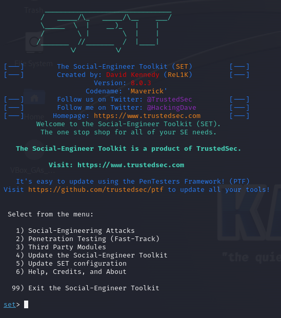
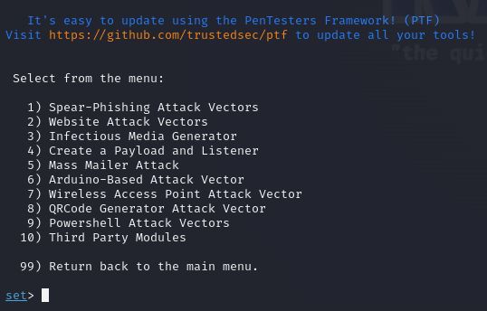
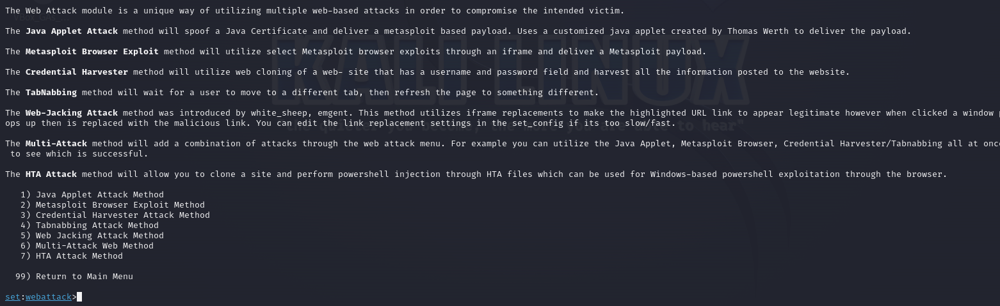
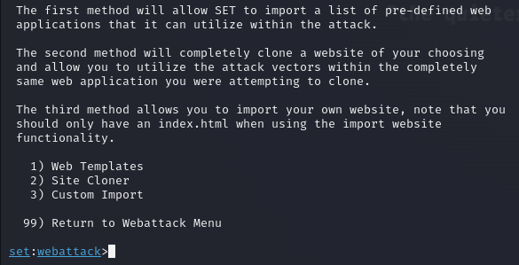
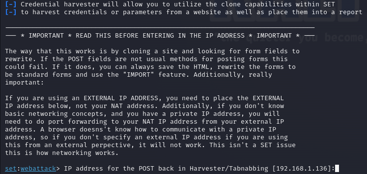
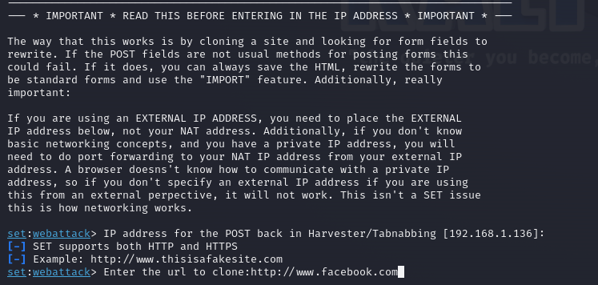
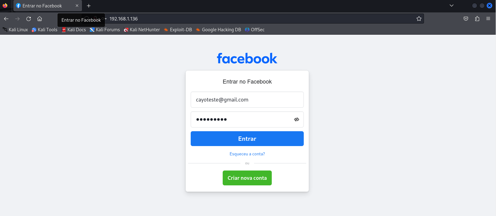
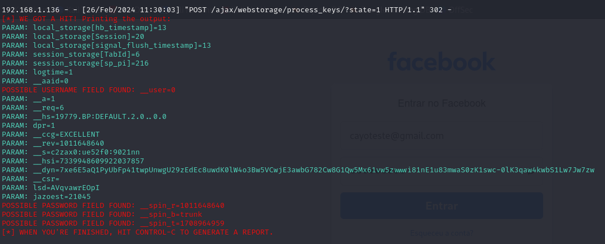

# dio-lab-cibersecurity-phishing
Repositório do Desafio DIO - Criação de um Phishing com o Kali Linux

Neste projeto nós utilizamos a ferramenta setoolkit para criar um phishing para captura de senhas do Facebook.

## Ferramentas

- Kali Linux
- setoolkit

## Configuração do Phishing no Kali Linux

- Acesso root na máquina: ```sudo su```
- Iniciando o setoolkit: ```setoolkit```



- Tipo de ataque: ```1 - Social-Engineering Attacks```



- Vetor de ataque: ```2 - Web Site Attack Vectors```



- Método de ataque: ```3 - Credential Harvester Attack Method ```



- Método de ataque: ```2 - Site Cloner```



- Inserir o endereço da máquina que deseja usar, ou utilizar o padrão



- URL para clone: http://www.facebook.com

## Resultado

- O serviço iniciará uma página false de login do Facebook, e ao inserir os dados, será redirecionado para o siteoriginal.



- E mostrará os dados capturados no terminal

